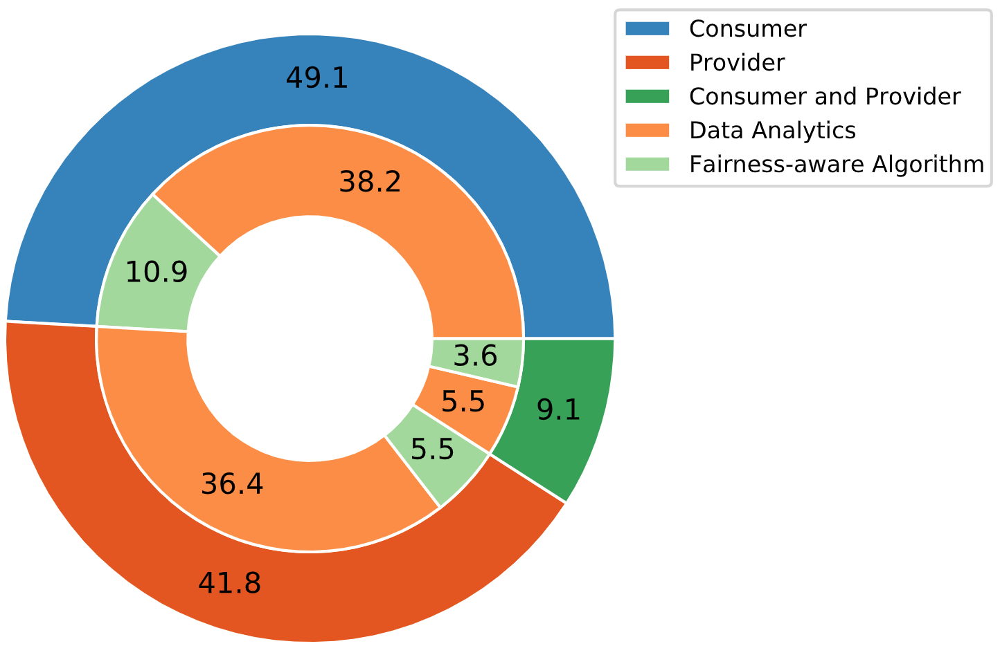

# CPFairRecSys
The re-ranking method for a fair recommendation w.r.t both users and items dimension.

## Some Statistics



## Dataset Prepration
- **ratings_data.txt**: `user-item interactions (raw file)` (by download, from Cornac or another resource)
- **[DatasetName]_data.txt**: This file is a `k-core` file that the users and items ids are mapped to a new range of indecies.
- 

## Datasets
All the datasets used in the experiments are in the `datasets` folder. Each dataset contains several files and a folder including:

- **Folder:**
  - groups: includes two sub-folders, `items` and `users`, in the items folder we have the item groups (`longtail_items.txt` and `shorthead_items.txt`) and in users folder we have two folders (`005` and `020`) each includes two user group files, i.e., `active_ids.txt` and `inactive_ids.txt`.
- **Files:**
  - ratings_data.txt
  - [DatasetName]_data.txt
  - [DatasetName]_inters.txt
  - [DatasetName]_train.txt
  - [DatasetName]_test.txt
  - [DatasetName]_tune.txt

## Model
To run them model you need to run the `fair_model` notebook:
```
https://colab.research.google.com/github/rahmanidashti/CPFairRecSys/blob/main/fair_model.ipynb
```
## Team
<a href="https://www.linkedin.com/in/ehsan-naghiaei/">Mohammadmehdi Naghiaei</a>, DECIDE, University of Southern California

<a href="http://rahmanidashti.github.io/">Hossein A. Rahmani</a>, Web Intelligence Group, UCL

<a href="https://yasdel.github.io/">Yashar Deldjoo</a>, SisInf Lab, Polytechnic University of Bari

## Citation
If you use our source code, dataset, and experiments for your research or development, please cite the following paper:

```
@inproceedings{naghiaei2022cpfairness,
  title={CPFair: Personalized Consumer and Producer Fairness Re-ranking for Recommender Systems},
  author={Mohammadmehdi Naghiaei, Hossein A. Rahmani, Yashar Deldjoo},
  booktitle={The 45th International ACM SIGIR Conference on Research and Development in Information Retrieval},
  year={2022}
}
```

## Acknowledgements
TBA

## Contact
If you have any questions, do not hesitate to contact us by `h.rahmani@ucl.ac.uk` or `rahmanidashti@gmail.com`, we will be happy to assist.
